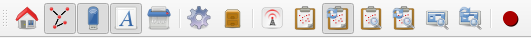

==========================
NeuroScheme User Interface
==========================

--------------
NeuroScheme UI
--------------

After loading a scene the user will be presented with the pane view containing all the entities in a grid visualization (:numref:`fig1`). 

.. _fig1:

   NeuroScheme user interface.  

----------------
NeuroScheme Menu
----------------

The application menu provides actions to load and save data, and to configure several options.

^^^^^^^^^
File Menu
^^^^^^^^^

The **File** menu provides the actions:

- **Clean Scene**: Removes the loaded data and cleans the view. 
- **Import JSON**: Loads scene data in JSON format. 
- **Export JSON**: Saves the current scene to disk in JSON format. 
- **Load BlueConfig**: Disabled.
- **Load XML Scene**: Loads scene in NeuroML format (XML).
- **Quit**: Exits the application. 

^^^^^^^^^^
Panes Menu
^^^^^^^^^^

The **Panes** menu provides actions to open and close view panes:

- **Split Vertically**: Splits the current pane into two vertical panel. 
- **Split Horizontally**: Splits the current pane into two horizontal panes.
- **Kill pane**: Closes the current pane.

^^^^^^^^^
View Menu
^^^^^^^^^

The **View** menu provides options to configure the panes visualization:

- **Home**: 
- **Show connectivity**: Shows or hides the connections between the entities in the scene. 
- **Show non-hierarchical entities**: Shows or hides non-hierarchical entities in the scene.
- **Show entities name**: Shows or hides the names of the entities in the scene. 

^^^^^^^^^^^
Events Menu
^^^^^^^^^^^

The **Events** menu provides actions regarding the communication with other applications:

- **Auto publish selection**: Enables or disables the automatic publication of selections in the scene. 
- **Publish selection**: Published the current selected entities. 
- **Send auto focus event on display**: Enables or disables the publication of a focus event on display.
- **Focus event on displayed**: Publishes a focus event on the displayed entities. 
- **Send focus on selection**: Publishes a focus event on the selected entities. 
- **Auto focus on selection**: Enables or disables the automatic publication of a focus event on the selected entities.

^^^^^^^^^
Help Menu
^^^^^^^^^

The **Help** menu provides access to the **About** dialog that shows information about the application. 

- **About...**: Displays the about dialog. 

-------------------------------
NeuroScheme Application Toolbar
-------------------------------

The application bar presents several icons to perform actions such as sending events, showing or properties of the entities in the scenes (:numref:`fig2`). 

.. _fig2:

   NeuroScheme application tool bar. 

From left to right:

- **Home**: Resets the view. 
- **Show connectivity**: Shows/Hides the entities relationships. 
- **Show non-hierarchical entities**: Shows/Hides non-hierarchical entities. 
- **Show entities name**: Shows/Hides the entities' name. 
- **Clean scene**: Removes the scene and clears the view. 
- **Search and filter**: Opens the panel to sort or filter entities based on its properties. 
- **Saved selections**: Opens the panel to save or restore a selection of entities. 
- **Connect/Disconnect ZeroEQ**: Connects/Disconnects the application from ZeroEQ events. 
- **Publish Selection**: Publishes the currently selected entities. 
- **Auto publish selection**: Enables/Disables the automatic publication of selected entitites. 
- **Send focus event of selected entitites**: Sends a focus event on the currently selected entitites. 
- **Automatically send focus event on selection**: Enables/Disables the automatic publication of a focus event on the selected entities. 
- **Send focus event of displayed entitites**: Sends a focus event on the currently displayed entities. 
- **Automatically send focus event on displayed**: Enables/Disables the automatic publication of a focus event on the displayed entities. 

------
Panels
------

^^^^^^^^^^^^^^^^^^^^^^^^^^^^^^^
Layout, search and filter panel
^^^^^^^^^^^^^^^^^^^^^^^^^^^^^^^

The **layout, search and filter** panel allows the manipulation of the visualization of the selected view pane (:numref:`fig3`). 

The **layout** allows the modification of the representation of the entities. The graph can be configured as:

- **Grid**: Entities placed as a grid, with the options to set the X and Y coordinates padding. 
- **3D**: Entities placed in 3D positions. 
- **Scatterplot**: Entities placed as a X/Y plot. The options allow the user to specify the properties represented in the X and Y axis.
- **Circular**: Entities placed in a circle, with the option to specify the radius of the representation. 
- **Free**: In this mode the entities can be selected by the mouse left button and, once selected, can be moved holding down the shift key and moving the mouse. The entities can be placed anywhere on the pane view. 

.. _fig3:

   Layout part of the panel. 

^^^^^^^^^^^^^^^
Selection panel
^^^^^^^^^^^^^^^

The entities can be selected in the view pane by left clicking on them. The selection panel allows the user to store the selection, or to restore or delete an old selection (:numref:`fig4`). 

.. _fig4:

   Selection panel. 

When a selection is stored it will ask the user for a name for the selection (:numref:`fig5`). 

.. _fig5:

.. figure:: images/NSImage006.png
   :alt: Selection name dialog. 
   :align: center

   Selection name dialog. 

^^^^^^^^^^^^^^^^^^^^^^^
Entity inspection panel
^^^^^^^^^^^^^^^^^^^^^^^

The entity inspection panel can be opened by using the context menu (right mouse click) on any entity and allows the modification of the properties of the entity. The entity can be deleted from the model using this panel (:numref:`fig6`). 

.. _fig6:

   Entity inspection panel. 

^^^^^^^^^^^^^^^^^^^^^^
Connections list panel
^^^^^^^^^^^^^^^^^^^^^^

The **connections list panel** can be opened by using the context menu (right mouse click) on any entity and allows the modification or removal of the relationships between entities (:numref:`fig7`). 

.. _fig7:

   Connections list panel. 

^^^^^^^^^^^^^^^^^^^^^^^^^^
Connection inspector panel
^^^^^^^^^^^^^^^^^^^^^^^^^^

The **connection inspector panel** can be opening by hovering over a connection and using the context menu (right mouse click). It allows the modification of the connection properties (:numref:`fig8`). 

.. _fig8:

   Connection inspector panel. 

------------- 
Context menus
-------------

^^^^^^^^^^^^^^^^^^^
Entity context menu
^^^^^^^^^^^^^^^^^^^

The entity **context menu** provides access to several panels to visualize and modify the properties of the entity or the entity itself. The default entries are:

- **Edit**: shows the entity inspection panel. 
- **Delete**: removes the entity from the view pane. 
- **Duplicate**: duplicates the entity. 
- **Show connections**: opens the connections list panel. 

Other entries can appear depending on the current model configuration, and depend on the entity being clicked. 

^^^^^^^^^^^^^^^^^^^^^^^
Connection context menu
^^^^^^^^^^^^^^^^^^^^^^^

The connections also have a context menu with a default entry:

- **Edit relationship**: Shows the connection inspector panel to edit connection properties. 

^^^^^^^^^^^^^^^^^
Pane context menu
^^^^^^^^^^^^^^^^^

If the context menu is requested when the mouse is not hovering an entity or a connection the view panel context menu is show. This menu allows the user to add entities and inputs/outputs. 

------------------
Keys and shortcuts
------------------

The following actions can be performed by clicking the button, selecting the option at menu bar and pressing the corresponding key combination:

- **Ctrl + K**: Close current view pane. 
- **Ctrl + H**: Home. 
- **Ctrl + C**: Show/Hide connectivity in the view panes. 
- **Ctrl + I**: Show/Hide non-hierarchical entities.  
- **Ctrl + S**: Publish selection event. 
- **Ctrl + Q**: Close application.
