=======
Runbook
=======

.. note::
   This runbook will test the main functionalities of NeuroScheme and can be considered as a basic tutorial, but **not** as a complete and exhaustive tutorial of all its functionalities.

For the runbook we'll use the :ref:`testDataset-label` presented in the introduction section.

-----------
Cortex test
-----------

^^^^^^^^^^^^^^^^^^^^^^^^^^^^
Load the cortex test dataset
^^^^^^^^^^^^^^^^^^^^^^^^^^^^

.. code-block:: bash

   ./NeuroScheme -d cortex -xml neuroscheme-example-data/neuroscheme-cortex-example-data.xml

The application should load the example dataset and present the :numref:`rbfig1` screen.

.. _rbfig1:

   NeuroScheme with the cortex example data.

^^^^^^^^^^^^^^^^^
Show all children
^^^^^^^^^^^^^^^^^
   
Select column 0 (c0) and use the context menu (right-click) and select 'Expand children'. The pane should show now the column 1 and the two microcolumns of column 0 (name mc0 and mc1, :numref:`rbfig2`). Select microcolumn 0 and expand children again. The pane should show now the two neurons of the microcolumn 0 of the column 0 (:numref:`rbfig3`).

.. _rbfig2:   
   
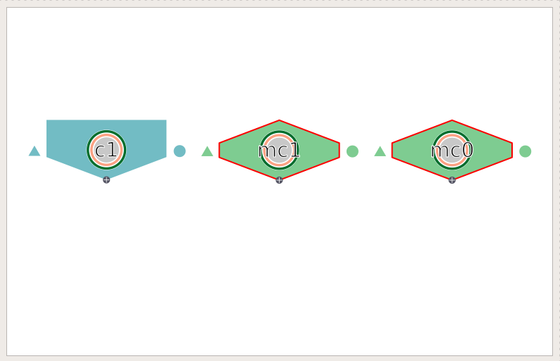

   Column 1 and microcolumn 0 and 1 of column 0.

.. _rbfig3:

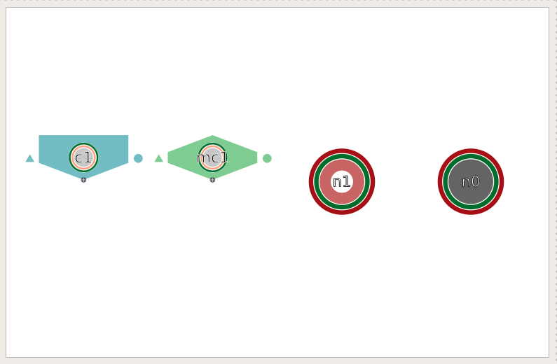

   Column 1 and microcolum 1 and neurons of microcolum 0 of column 0.

Do the same with the column 1 and microcolumn 1 of column 0 until the pane shows all the neurons of the dataset (:numref:`rbfig4`).

.. _rbfig4:

   All neurons of the dataset.

^^^^^^^^^^^^^^^^^^^^^^^^^^^
Edit properties of a neuron 
^^^^^^^^^^^^^^^^^^^^^^^^^^^

Select the neuron 'n3' and open the edition panel using the 'Edit' entry in the context menu. The properties of the neuron will be shown and ready to be edited (:numref:`rbfig5`).

.. _rbfig5:

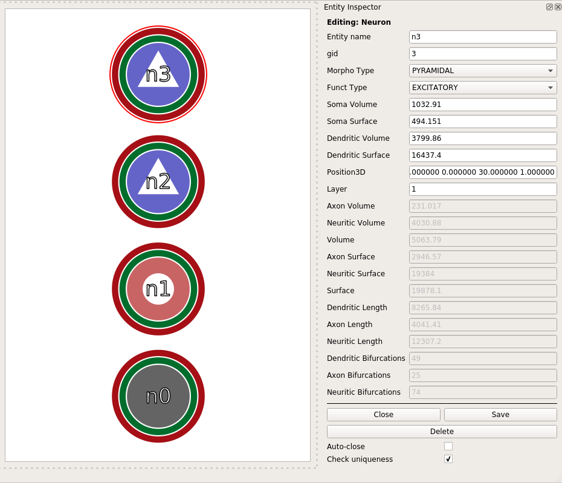

   All neurons of the dataset and the edition panel. 

Modify the following properties and click the **Save** button. The pane should show now the modified properties of the neuron, changing its internal representation to a circle (interneuron) instead of a triangle (neuron), the color from blue (excitatory) to red (inhibitory) and the transparency and length of the rings that represent the other modified properties (:numref:`rbfig6`).   

.. _rbfig6:

   Modified the properties of neuron n3. 

^^^^^^^^^^^^^^
Multiple panes
^^^^^^^^^^^^^^

Click the **Home** button (or click 'Ctrl+H') to go back to the first pane view (:numref:`rbfig1`). Select column 0 and use the entry 'Expand group (new pane)' and do the same with the column 1. The view should show now three panes like :numref:`rbfig7`.   

.. _rbfig7:

   A pane showing the colums and other two panes showing the neurons of column 0 and column 1. 

Select the pane with neuron 'n3' and kill it with Ctrl+K or using the entry on the 'Panes' menu. Do the same with the pane containing the other neurons. The view should show now the same representation as the initial one (:numref:`rbfig1`).   

-----------
Congen test
-----------

^^^^^^^^^^^^^^^^^^^^^^^^^^^^
Load the congen test dataset
^^^^^^^^^^^^^^^^^^^^^^^^^^^^

.. code-block:: bash

   ./NeuroScheme -d congen --json neuroscheme-example-data/neuroscheme-congen-example-data.json

The application should load the example dataset and present the :numref:`rbfig8` screen.

.. _rbfig8:

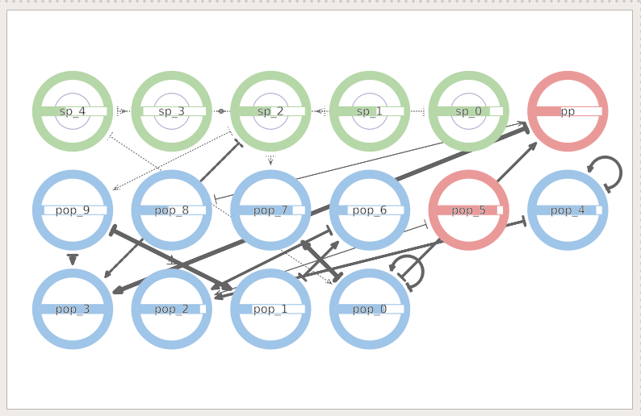

   NeuroScheme with the congen example data.

^^^^^^^^^^^^
Pane layouts
^^^^^^^^^^^^

Click the **Search and Filter** button in the toolbar to open the 'Search and filter' panel for pane 0 (:numref:`rbfig9`). 

.. _rbfig9:

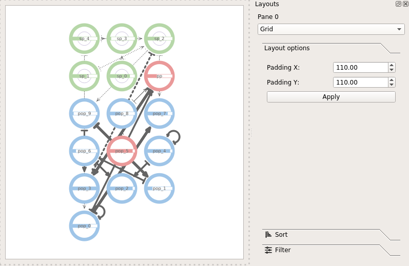

   Search and Filter panel for pane 0.

Modify the **Layout** setting to **ScatterPlot** and set the X and Y axis to the values given below. The pane should look like :numref:`rbfig10`.

====  =============
Axis  Value  
====  =============
X     Nb of neurons
Y     Child depth
====  =============

.. _rbfig10:

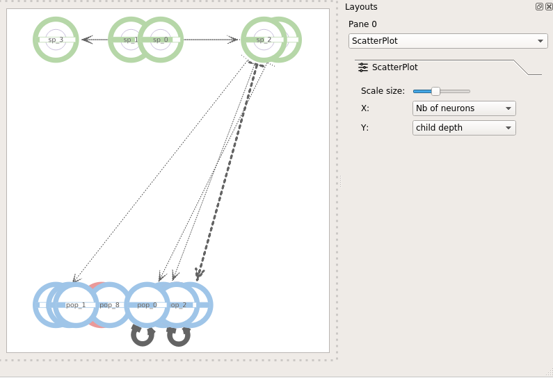

   ScatterPlot layout.

Modify the **Layout** setting to **Circular**. The pane should look like :numref:`rbfig11`.

.. _rbfig11:

   Circular layout.

Add a **Sort** filter. Sort by **Nb of neurons** in descendant order. The pane should look like :numref:`rbfig12`.

.. _rbfig12:

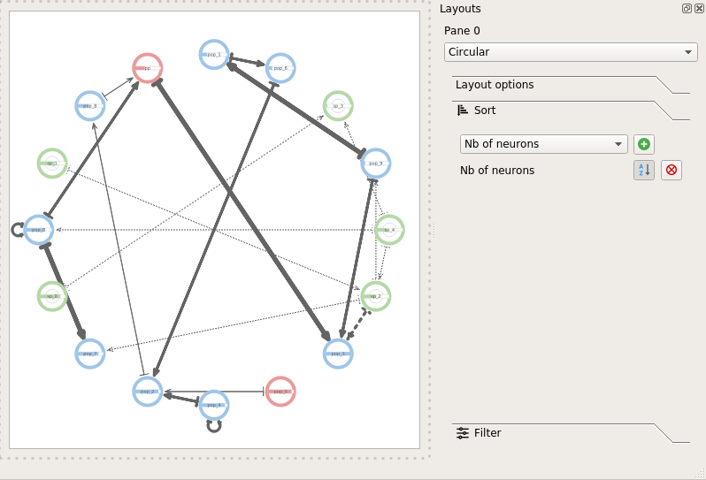

   Sort by Nb of neurons.

Add a **Filter**. Filter by **Child depth** only the ones with depth 0. The pane should look like :numref:`rbfig13`.

.. _rbfig13:

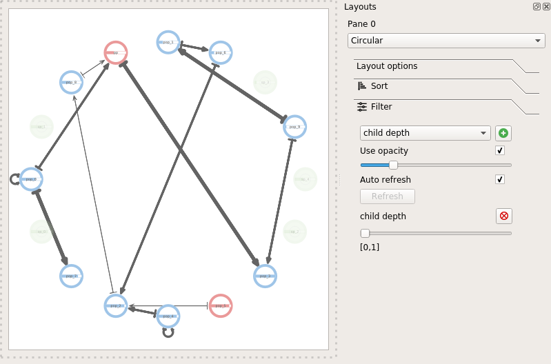

   Filter by child depth.

Reset the filter and the sort by deleting them using the **delete button**. Modify the layout to **Grid** so the pane look like :numref:`rbfig8`.
Modify the layout to **Free**. Now hold down the **Shift key** and **left click** on entity **sp 4**, you should be able to move the entity freely across the pane (:numref:`rbfig14`). 

.. _rbfig14:

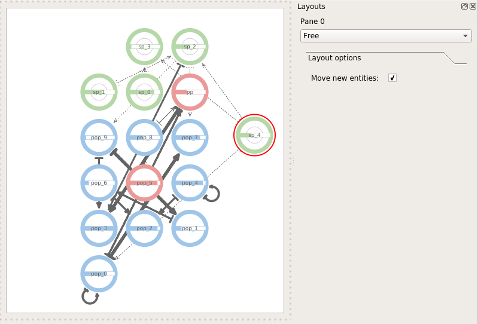

   Free placement of entities.

^^^^^^^^^^^^^^^^^^^^^^^^^^^^^^^^
Entity and relationships edition
^^^^^^^^^^^^^^^^^^^^^^^^^^^^^^^^

**Right click** on entity **sp 4** and use the **Edit** entry. The **Entity Inspector** panel should open. Modify the entity name to **sp_4_mod** and click the **Save** button (:numref:`rbfig15`).

.. _rbfig15:

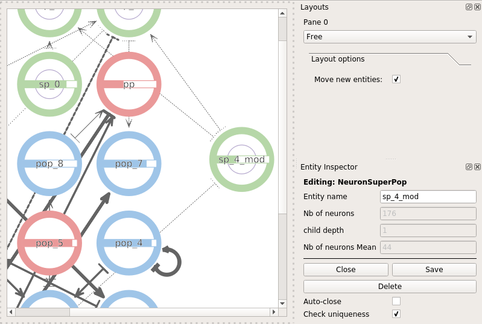

   Entity edition panel.

The entity edition panel is different depending on the entity being edited. The same happens with relationships. Close the entity edition panel using the close button. 

Put the cursor over the pop0 to pop7 relationship, when the cursor is over the relationship the color of it will change to red. **Right click** to open the context menu and use the **Edit relationship** entry. The **Connection inspector** panel should open (:numref:`rbfig16`) letting the user modify the properties of the relationship.

.. _rbfig16:

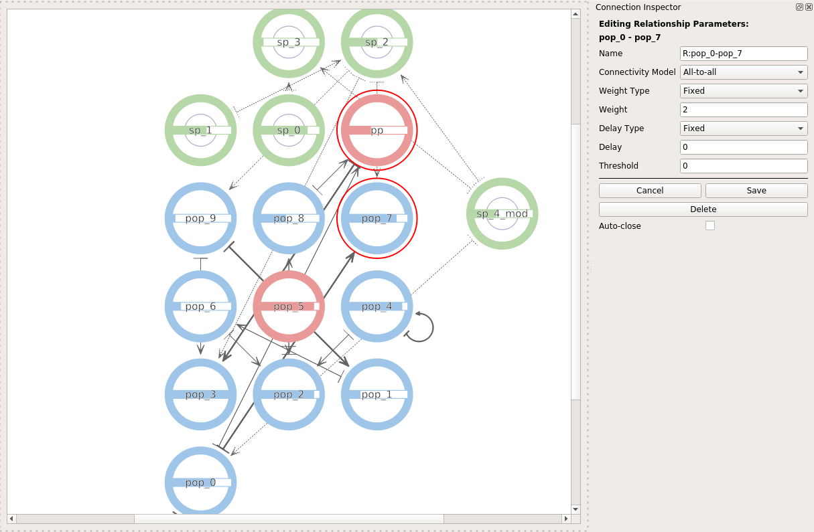

   Relationship edition panel.

